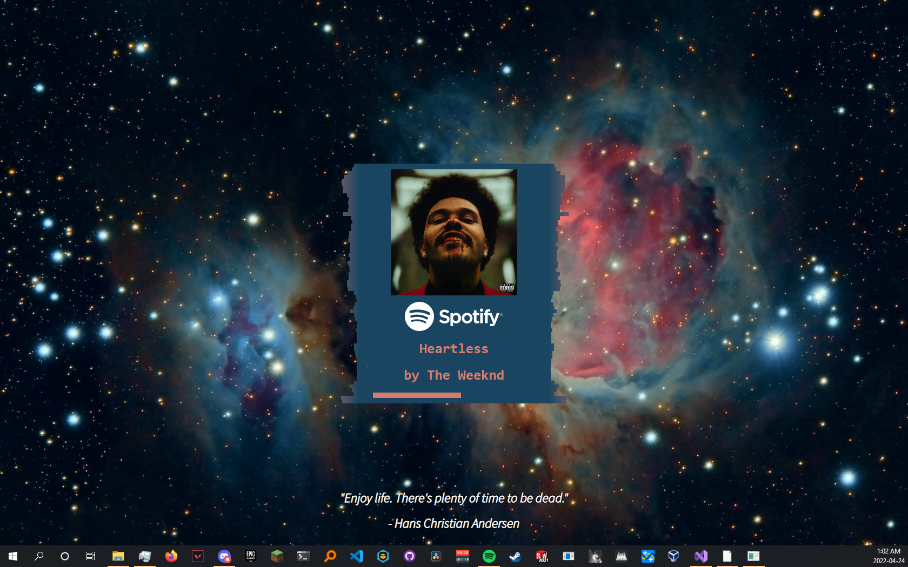

# My custom wallpaper engine wallpaper

## Features

- ### Media Information
    Through the use of a background python Flask server, this wallpaper is able to display information about the currently playing song (album, song name, artist name). This server must be started run seperately from wallpaper engine, because it wallpaper engine doesn't support running external application. I use [NSSM](https://nssm.cc/) to automatically start it when I turn on my computer. The wallpaper updates the information every 5 seconds.

- ### Dynamic Background Image
    Using the Unsplash API, the wallpaper randomly chooses a picture to use as the background. The image is automatically updated at midnight, and themes can be chosen by the user to increase customization. the wallpaper tries to only choose pictures that are the same resolution as your display.

- ### Quote of the Day
    The quote of the day is fetched from [zenquotes.io](https://zenquotes.io/) and displayed on the wallpaper. This quote changes daily with the wallpaper.

